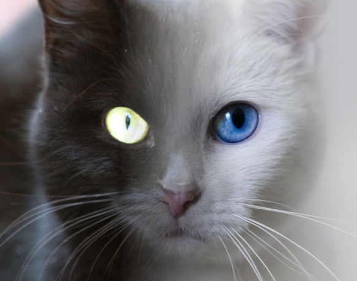

# Mixer de Imagens PPM

Este é um projeto desenvolvido como parte do curso de Introdução à Computação Gráfica no Departamento de Matemática da Universidade Federal de Sergipe, sob a orientação do Prof. Evilson Vieira.

### Descrição
O mixer é um programa simples que mescla duas imagens no formato PPM.

### Resultado

<div>
    
</div>

### Como Compilar
Para compilar o código, utilize o seguinte comando:
```bash
gcc mixer.c -o mixer -lm
```
Sintaxe
Para executar o programa, utilize o seguinte formato:
```bash
./mixer gatobranco.ppm gatopreto.ppm
```